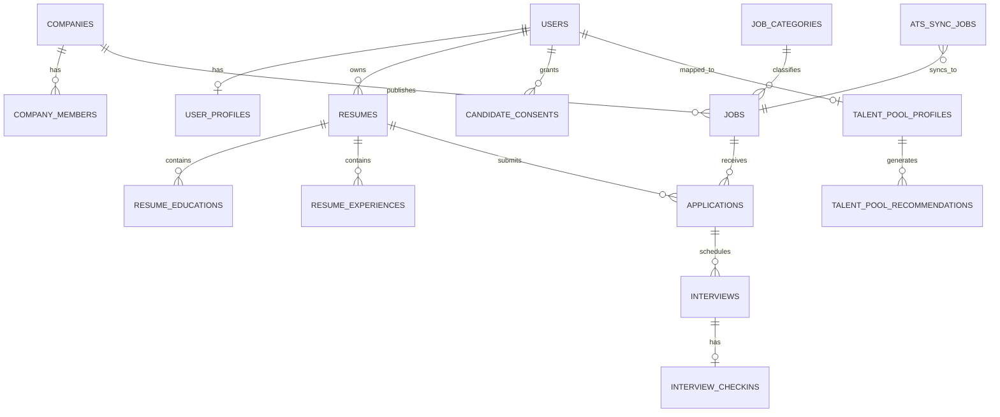
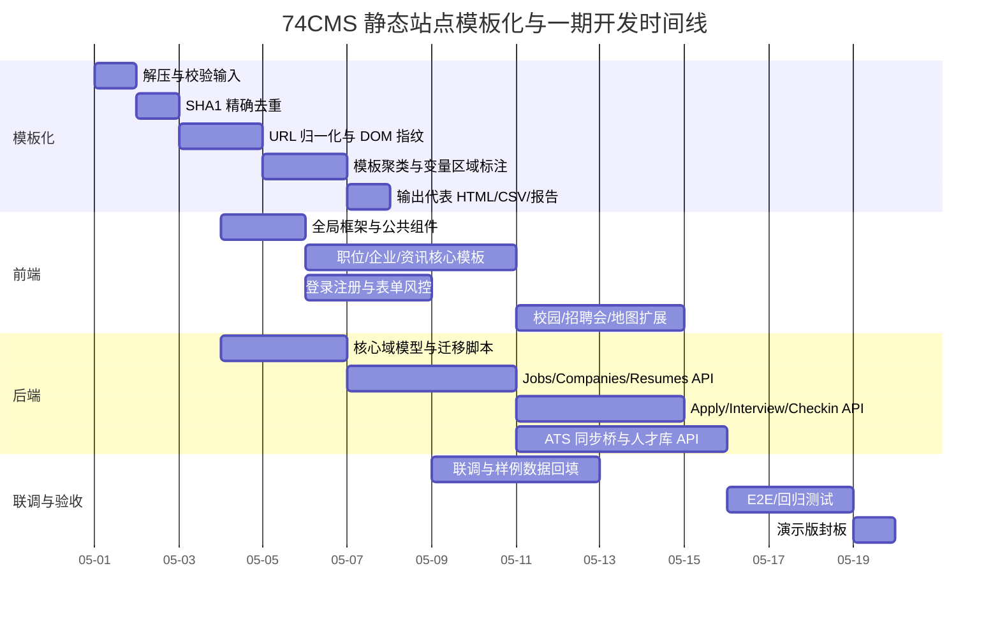

# 74CMS 静态站点模板化开发分析报告

## Executive Summary

本次分析以你上传的三类静态资产为基础：一是 `html.zip` 中的 5,150 个原始 HTML 页面，二是之前生成的 `html_dedup_unique_templates.zip`，三是补充的 `74cms.zip`（含部分带样式页面与补充导航页面）。离线分析结果表明，这批页面可以稳定收敛为 **42 个工程可用的模板簇**；其中 **6 个模板就覆盖了 94.95% 页面量**，所以开发上不应该把 5,000+ 个页面逐页“翻译”为组件，而应先做“模板级收口”，再围绕职位、企业、简历、活动、内容中心等少量高复用模板实现。与此同时，74CMS 官方公开信息显示，它本质上是一个平台级人才招聘系统，支持 PC、WAP、H5、小程序、APP，多端同步，运行环境为 Linux + 宝塔 + Nginx，开发语言为 PHP + MySQL；官方文章也明确其覆盖平台管理后台、企业招聘端和求职者端。与你此前上传的内部分析稿一致，更合理的路线不是“照搬 74CMS”，而是把它当成前台壳子与模板参考，同时把 AI 客户端职位同步、ATS 桥接、面试签到、授权入库、本地人才库与推荐回流链路作为自研主线。citeturn1view0turn2view0 fileciteturn0file0

工程结论可以压缩成一句话：**前台模板参考 74CMS，业务闭环不要参考 74CMS。** 也就是说，列表、详情、资讯、招聘会、校园招聘这类“站点壳子”非常适合复用其信息架构与页面骨架；但一旦进入你们真正的差异化闭环——职位从 AI 客户端进入 ATS、再进入人才网，候选人在面试或签到节点完成授权与沉淀，再流入本地人才库并支持推荐回流——就必须按你们自己的产品边界与数据流重建。fileciteturn0file0

## 输入范围与总体结论

本报告的输入范围与使用方式如下：

| 输入资产 | 角色 | 本次用途 | 备注 |
|---|---|---|---|
| `html.zip` | 主分析输入 | 原始模板聚类、路由推断、页面分类 | 离线确认含 5,150 个 HTML |
| `html_dedup_unique_templates.zip` | 已有去重结果 | 复核代表页面、读取现有 mapping | 内含 42 个代表模板与 CSV |
| `74cms.zip` | 补充输入 | 补齐主压缩包未覆盖的导航页、企业登录/注册等页面线索 | 含 24 个带样式补充页面 |
| `74cms人才网开发分析(2).pdf` | 业务边界依据 | 约束一期边界与自研闭环优先级 | 与本次技术分析配套使用 |

离线统计后的关键结论如下：

| 指标 | 结果 |
|---|---:|
| 原始 HTML 文件数 | 5,150 |
| 精确重复文件 | 1 |
| 精确唯一 HTML | 5,149 |
| 最终模板簇数量 | 42 |
| 前 6 个模板覆盖页数 | 4,890 |
| 前 6 个模板覆盖占比 | 94.95% |
| 明显 CSR shell 页面 | 2 页 |
| 其余页面渲染方式 | 以 SSR 直出 HTML + JS 增强为主 |

其中最重要的工程发现有两个。

第一个发现是：**绝大多数页面重量都集中在“列表型筛选页”**。职位列表、急聘职位列表、名企直聘职位列表、简历列表、校园职位列表，再加上今日招聘详情，几乎已经吞掉整个静态包。这意味着在 Codex 或开发团队的实际实现中，真正值得最先稳定下来的并不是“42 个模板同时开工”，而是先把 `List + Detail + Search + Filter + Pagination + Auth` 这一套公共壳子抽象出来，再把不同频道作为传参模式。这样做，才能把 42 个模板进一步落到十几个高复用组件上，而不是 42 套相互复制的页面。

第二个发现是：**主包中几乎没有完整的后台或企业中心页面**。大站点包主要覆盖的是公开门户前台；企业登录/注册、求职登录/注册、求职登记等线索，在补充包 `74cms.zip` 中更清楚。这与 74CMS 官方把产品定义为平台级系统、包含平台管理后台、企业招聘端、求职者端是吻合的，但当前你给出的静态资产对“后台业务流”只提供了有限页面证据，因此这部分实现必须以产品方案驱动，而不能完全指望静态页面反推。citeturn2view0

本次报告中明确标记为“未指定”的事项包括：

| 未指定项 | 当前状态 | 对开发的影响 |
|---|---|---|
| 是否需要保留原始目录结构 | 未指定 | 影响代表模板输出目录与路由兼容策略 |
| 是否必须 1:1 保留 74CMS SEO 路由 | 未指定 | 影响前端路由兼容与 Nginx rewrite |
| 是否包含后台管理静态页 | 未提供 | 后台需按业务方案重建 |
| 是否需要完整企业端会员中心 | 未充分提供 | 只能从补充静态页与业务流程推断 |
| 是否要求纯 SSR、SSR + CSR 混合、或 SPA | 未指定 | 影响前端框架选型 |
| 是否已经有 ATS 既定 API 协议 | 未指定 | 影响桥接层 DTO 与签名机制 |
| 是否要保留与 74CMS 完全一致的筛选参数命名 | 未指定 | 影响接口兼容层设计 |

## 模板聚类方法与去重规则

### 复现目标

这一步的目标不是“把相同 HTML 合并”，而是把 **看起来不同、但开发时本质是一套模板的页面收口到同一模板簇**。例如：

- `job.html`
- `job_c1_1.html`
- `job_c1_1_c2_11_c3_53.html`
- `job_c1_1_c2_11_c3_53_trade_12.html`
- `job_c1_1_c2_11_c3_53_w1_8000_w2_12000.html`

这些页面虽然文件名不同、内容也不同，但对开发来说都是 **职位列表模板 + 不同筛选态**，应该归并到同一个模板族，而不是当成几十套页面分别实现。

### 推荐算法流水线

建议把模板聚类做成四层流水线，而不是一次性靠某个相似度阈值决定全部结果：

| 层级 | 目的 | 方法 | 推荐库/工具 |
|---|---|---|---|
| 精确去重 | 去掉字节级重复 | SHA1 / CRC32 / 文件大小联合 | Python `hashlib`, Node `crypto` |
| 路由归一化 | 先把同一路由族聚成候选集 | 文件名/URL 参数正规化 | Python `re`, Node `path-to-regexp` |
| DOM 指纹 | 判断是否同模板骨架 | Tag-path multiset、稳定 class token、表单 schema、重复块签名 | `BeautifulSoup`, `lxml`, `selectolax`, `cheerio` |
| 变量区识别 | 抽出模板占位符 | XPath/DOM path 对齐 + 文本/属性差异统计 | `lxml`, `diffDOM`, `rapidfuzz` |

### 可直接落地的判定规则

**精确去重规则**

1. 读取每个 HTML 文件字节流。
2. 计算 `sha1(html_bytes)`。
3. `sha1` 相同则视为精确重复。
4. 如果同一 `sha1` 对应两个不同语义路径，记录为“路由别名页”，不要直接丢弃；你这批数据里就出现了 1 组这样的精确重复。

**路由归一化规则**

把路径或文件名统一替换为模板化参数：

- 数字 ID：`/job/68.html` → `/job/{jobId}.html`
- 分类链路：`job_c1_1_c2_11_c3_53.html` → `job_c{n}_{n}_c{n}_{n}_c{n}_{n}.html`
- 分页：`resume.html_page=2.html` → `resume.html_page={page}.html`
- 工资区间：`w1_8000_w2_12000` → `w1_{min}_w2_{max}`
- 时间/新鲜度：`settr_7` → `settr_{days}`
- 行业：`trade_12` → `trade_{tradeId}`
- 企业性质：`nature_48` → `nature_{natureId}`

**DOM 指纹规则**

建议每个页面提取以下结构特征并组成向量：

- `TAG` 频次：`div`, `ul`, `li`, `form`, `table`, `article`
- `PATH` 频次：如 `body > div.header > div.nav > ul > li`
- 稳定 `class` token：去掉数字、哈希串与状态类后保留
- 表单 schema：`input[type]`, `button`, `select`, `textarea`
- 重复块签名：`JobCard`, `CompanyCard`, `ResumeCard` 这类 `li[*]` / `.item[*]`
- 头图区、侧边栏、页脚等全局壳子特征
- 页面专属 CSS / JS 入口（例如职位详情页、地图页、企业列表页的专属脚本）

相似度建议使用：

- **候选召回**：MinHash / SimHash / Route family
- **精排**：Weighted Jaccard 或 Cosine Similarity
- **最终聚类**：语义域约束后的层次聚类或 union-find

### 推荐阈值与调参建议

| 场景 | 初始阈值 | 说明 |
|---|---:|---|
| 精确重复 | 1.00 | 仅字节完全一致 |
| 同一路由家族候选 | 不设阈值 | 先按归一化名称进入候选集 |
| 列表页结构合并 | 0.88–0.92 | 列表页重复块多，文本差异大，阈值不宜过高 |
| 详情页结构合并 | 0.92–0.96 | 详情页骨架更稳定，可提高阈值 |
| 登录/注册/表单页 | 0.95+ | 容易误合并，建议更严格 |
| 长尾专题页 | 人工复核 | 基数低，自动化成本不高但误差影响大 |

调参原则很简单：

- 聚类过碎，就把阈值降低 0.02。
- 聚类过宽，就把阈值提高 0.02。
- 但无论阈值如何，**不同语义域不要硬合并**：`job_*`、`resume_*`、`company_*`、`article_*`、`jobfair_*`、`campus_*`、`member_*` 应先按域隔离，再谈相似度。

### 可变区域识别规则

建议把“变量”分成五类处理，而不是统一替换成 `{{text}}`：

| 变量类型 | 识别规则 | 例子 | 占位符建议 |
|---|---|---|---|
| 文本变量 | 同一 DOM 路径下文本变化率高 | 标题、公司名、摘要 | `{{title}}`, `{{company_name}}` |
| 数字变量 | 命中金额/数量/浏览量/页码正则 | 工资、招聘人数、浏览数 | `{{salary_min}}`, `{{views}}` |
| 时间变量 | 命中日期时间正则 | 发布时间、面试时间 | `{{publish_at}}`, `{{interview_at}}` |
| ID 变量 | 命中路径参数、`data-id`、隐藏域 | `job/68`, `company/2` | `{{job_id}}`, `{{company_id}}` |
| URL 变量 | `href/src/action` 中可变部分 | 详情链接、分页链接、图片链接 | `{{detail_url}}`, `{{avatar_url}}` |

建议使用以下规则把“点状变量”提升为“区域变量”：

1. 某 DOM 路径在样本页中出现率 ≥ 70%。
2. 该路径文本或属性的变化率 ≥ 40%。
3. 如果其父节点是 `li[*] / tr[*] / .item[*] / article[*]` 等重复块，则把父节点标为可重复区域。
4. 如果一块区域的子节点可变率 > 50%，则提升为区域级占位符，如 `{{jobs[*]}}`、`{{articles[*]}}`、`{{companies[*]}}`。

### 可复现伪代码

```python
for file in html_files:
    raw = read(file)
    sha1 = sha1sum(raw)
    if sha1 in exact_seen:
        mark_duplicate(file, exact_seen[sha1])
        continue

    route_norm = normalize_route(file.name)
    dom = parse_html(raw)

    dom_tokens = extract_dom_tokens(
        tags=True,
        stable_classes=True,
        path_multiset=True,
        form_schema=True,
        repeatable_blocks=True
    )

    save_candidate(file, route_norm, dom_tokens)

for route_family in candidate_groups:
    lsh_candidates = minhash_query(route_family.dom_tokens)
    merged = semantic_guarded_cluster(
        candidates=lsh_candidates,
        threshold=list_or_detail_threshold(route_family)
    )

for cluster in merged_clusters:
    sample_pages = pick_samples(cluster, k=min(20, len(cluster)))
    variable_nodes = diff_dom_paths(sample_pages)
    region_roots = lift_to_repeatable_region(variable_nodes)
    emit_template(cluster, representative_html, variable_regions, mapping_csv)
```

### 这批页面的最终聚类结论

本次离线分析落地后的聚类结果是：**42 个模板簇**。这个数量是合理的，原因有三个：

1. 少于 20 个会过度合并，校园、招聘会、内容中心、地图、认证页会混在一起。
2. 多于 80 个会过度碎片化，Codex 会把 URL 变体误当成独立模板。
3. 42 个模板已经能让 5,150 个页面完整映射，而且工程上足够接近“几十个模板”的最佳区间。

## 模板清单与代表页面

### 核心招聘主线模板

这 10 个模板是一期最值得优先做成组件与页面壳子的部分。它们不仅决定了用户可见主链路，而且覆盖的静态页量最大。

| 模板ID | 页面类型 | 变体数 | 代表 HTML | 主路由 | 主要可变区域 | 开发优先级 |
|---|---|---:|---|---|---|---|
| `job_list` | 职位列表 | 2322 | `job_list__job.html` | `/job.html` | 筛选、排序、职位卡片、分页、侧栏 | P0 |
| `resume_list` | 简历库列表 | 687 | `resume_list__resume.html` | `/resume.html` | 筛选、排序、简历卡片、分页、侧栏 | P0 |
| `job_emergency_list` | 急聘职位列表 | 600 | `job_emergency_list__...c1_1.html` | `/job/listtype/emergency.html` | 筛选、排序、职位卡片、分页、侧栏 | P0 |
| `job_famous_list` | 名企职位列表 | 582 | `job_famous_list__job_famous_1.html` | `/job/famous/1.html` | 筛选、排序、职位卡片、分页、侧栏 | P0 |
| `company_list` | 企业列表 | 62 | `company_list__company.html` | `/company.html` | 筛选、排序、企业卡片、分页、侧栏 | P0 |
| `company_detail` | 企业详情 | 27 | `company_detail__company_2.html` | `/company/{companyId}.html` | 企业头部、企业画像、在招职位、介绍、地图 | P0 |
| `job_detail` | 职位详情 | 20 | `job_detail__job_68.html` | `/job/{jobId}.html` | 职位头部、要求、描述、企业信息、相关推荐 | P0 |
| `home` | 首页 | 1 | `home__.html` | `/` | 头部、搜索、频道楼层、公告、友情链接 | P0 |
| `member_login_personal` | 求职者登录 | 1 | `member_login_personal__member_login_personal.html` | `/member/login/personal` | 账号表单、验证码、协议、提交态 | P0 |
| `member_register_personal` | 求职者注册 | 1 | `member_register_personal__member_reg_personal.html` | `/member/reg/personal` | 注册表单、短信验证码、协议、提交态 | P0 |

这一组模板里，真正的“底层公共件”只有五类：

- `Header / Footer / Breadcrumbs`
- `FilterPanel / SortTabs / Pagination`
- `JobCard / CompanyCard / ResumeCard`
- `DetailHeader / MetaPanel / RichContent`
- `AuthShell / LoginForm / RegisterForm`

也就是说，**42 个模板不等于 42 套页面工程**。更贴近实际的前端实现方式是：做 12–18 个高复用组件，再由这些组件编排成 42 个页面模板。

### 内容、活动与校园模板

这一组模板决定网站的“站点完整度”，也是 74CMS 之所以像一个成熟地方招聘门户的关键组成部分。官方公开内容也把系统定位为平台级招聘系统，并强调企业端、求职端和管理端的完整性；你上传的 PDF 则进一步给出“保留成熟前台模块、核心业务闭环自研”的边界，因此这些模板很适合作为门户壳子，但不应挤占签到/授权/ATS 主线资源。citeturn2view0 fileciteturn0file0

| 模板ID | 页面类型 | 变体数 | 代表 HTML | 主路由 | 主要可变区域 | 开发优先级 |
|---|---|---:|---|---|---|---|
| `campus_job_list` | 校园职位列表 | 390 | `campus_job_list__campus_job.html` | `/campus/job.html` | 筛选、职位卡片、分页 | P1 |
| `daily_detail` | 今日招聘详情 | 309 | `daily_detail__dailyDetail_1.html` | `/dailyDetail/{id}.html` | 头部、正文、相关推荐 | P1 |
| `article_list` | 资讯列表 | 20 | `article_list__article.html` | `/article.html` | 分类、列表卡片、排行、分页 | P1 |
| `help_detail` | 帮助详情 | 20 | `help_detail__help_id_1.html` | `/help/id/{id}.html` | 标题、发布时间、正文、上一篇下一篇 | P1 |
| `hrtool_list` | HR 工具列表 | 13 | `hrtool_list__hrtool.html` | `/hrtool.html` | 分类、列表卡片、排行、分页 | P1 |
| `jobfair_list` | 招聘会列表 | 13 | `jobfair_list__jobfair.html` | `/jobfair.html` | 活动卡片、状态、分页 | P1 |
| `jobfairol_list` | 网络招聘会列表 | 13 | `jobfairol_list__jobfairol.html` | `/jobfairol.html` | 活动卡片、状态、分页 | P1 |
| `notice_list` | 公告列表 | 13 | `notice_list__notice.html` | `/notice.html` | 分类、列表卡片、分页 | P1 |
| `hrtool_detail` | HR 工具详情 | 11 | `hrtool_detail__hrtool_1.html` | `/hrtool/{id}.html` | 标题、正文、相关推荐 | P1 |
| `explain_detail` | 说明/协议 | 6 | `explain_detail__explain_1.html` | `/explain/{id}.html` | 标题、正文、上一篇下一篇 | P1 |
| `jobfairol_detail` | 网络招聘会详情 | 5 | `jobfairol_detail__jobfairol_1.html` | `/jobfairol/{id}.html` | 活动头图、时间地点、主办方、内容 | P1 |
| `jobfair_detail` | 招聘会详情 | 4 | `jobfair_detail__jobfair_1.html` | `/jobfair/{id}.html` | 活动头图、时间地点、主办方、内容 | P1 |
| `unknown` | 校园公告/宣讲/院校专题 | 4 | `unknown__campus_notice_1.html` | `/campus/notice.html` | 标题、正文、相关推荐 | P1 |
| `article_detail` | 资讯详情 | 3 | `article_detail__article_1.html` | `/article/{articleId}.html` | 标题、发布时间、正文、上一篇下一篇 | P1 |
| `notice_detail` | 公告详情 | 2 | `notice_detail__notice_1.html` | `/notice/{noticeId}.html` | 标题、正文、上一篇下一篇 | P1 |
| `campus_election_detail` | 校园双选会详情 | 1 | `campus_election_detail__campus_election_1.html` | `/campus/election/{id}.html` | 活动头图、时间地点、企业名单、正文 | P1 |
| `campus_election_list` | 校园双选会列表 | 1 | `campus_election_list__campus_election.html` | `/campus/election.html` | 列表卡片、筛选、分页 | P1 |
| `campus_home` | 校园招聘首页 | 1 | `campus_home__campus.html` | `/campus.html` | 头部、搜索、频道楼层 | P1 |
| `daily_list` | 今日招聘列表 | 1 | `daily_list__dailyList.html` | `/dailyList.html` | 列表卡片、筛选、分页 | P1 |
| `help_list` | 帮助中心列表 | 1 | `help_list__help.html` | `/help.html` | 分类、列表卡片、分页 | P1 |
| `jobfair_company_list` | 招聘会参会企业列表 | 1 | `jobfair_company_list__...id_3.html` | `/index/jobfair/comlist/id/{id}.html` | 企业卡片、分页 | P1 |
| `jobfair_reserve` | 招聘会报名页 | 1 | `jobfair_reserve__...id_3.html` | `/index/jobfair/reserve/id/{id}.html` | 活动信息、报名表单、风控、提交态 | P1 |
| `map_jobs` | 地图找工作 | 1 | `map_jobs__map.html` | `/map.html` | 地图容器、标记点、职位卡片、筛选 | P1 |

这里面有一个小的工程优化建议：`unknown` 模板不应该继续叫 `unknown`。从文件名与页面内容看，它更接近 `campus_misc` 或 `campus_topic`，建议在工程中重命名为 **`campus_misc_detail`** 或 **`campus_topic_detail`**，避免后续维护时出现“不知道这个文件干什么”的问题。

### 长尾专区、专题与别名模板

这组模板更适合作为二期扩展，或者在一期只保留入口，不优先做深业务集成。

| 模板ID | 页面类型 | 变体数 | 代表 HTML | 主路由 | 主要可变区域 | 开发优先级 |
|---|---|---:|---|---|---|---|
| `freelance_resume_detail` | 自由职业人才详情 | 5 | `freelance_resume_detail__freelance_resume_1.html` | `/freelance/resume/{id}.html` | 人才头图、技能报价、作品经历、联系 | P2 |
| `fast_job_list` | 快招职位列表 | 1 | `fast_job_list__fast_job.html` | `/fast/job.html` | 列表、筛选、分页 | P2 |
| `fast_resume_list` | 快招简历列表 | 1 | `fast_resume_list__fast_resume.html` | `/fast/resume.html` | 列表、筛选、分页 | P2 |
| `freelance_home` | 自由职业首页 | 1 | `freelance_home__freelance.html` | `/freelance.html` | 头部、分区楼层、入口卡片 | P2 |
| `freelance_resume_list` | 自由职业人才列表 | 1 | `freelance_resume_list__freelance_resume.html` | `/freelance/resume.html` | 列表、筛选、分页 | P2 |
| `freelance_subject_list` | 自由职业项目列表 | 1 | `freelance_subject_list__freelance_subject.html` | `/freelance/subject.html` | 列表、筛选、分页 | P2 |
| `live_index` | 直播专题入口 | 1 | `live_index__index_live_index.html` | `/index/live/index.html` | 专题卡片、Banner、CTA | P2 |
| `shortcut_detail` | 快捷入口别名页 | 1 | `shortcut_detail__index_shortcut_index.html` | `/index/shortcut/index.html` | 头部、正文、相关推荐 | P2 |
| `shortvideo_list` | 视频招聘 | 1 | `shortvideo_list__shortvideo.html` | `/shortvideo.html` | 视频列表、筛选、分页 | P2 |

其中 `shortcut_detail` 值得单独说明。离线精确去重发现，有一页本质上与某个网络招聘会详情页完全相同，所以这里不建议把它做成独立业务模板，而应作为 **路由别名/短链落地页** 处理：前端仍可保留页面壳子，但后端路由与数据模型不要单独建一套。

### 高优模板的可变区域示例与前端组件拆分

完整 42 个模板的 `variable_regions`、`component_split`、`component_io` 已写入下载包中的 `template_cluster_summary.csv`。正文里给出对开发最关键的 6 个样例。

#### 首页模板示例

```html
<section data-template="home">
  <SiteHeader city="{{city}}" />
  <GlobalSearchHero
    keyword="{{keyword}}"
    hotKeywords="{{hot_keywords[*]}}"
  />
  <ChannelNav items="{{channels[*]}}" />
  <SectionBlock
    title="{{sections[*].title}}"
    cards="{{sections[*].cards[*]}}"
  />
  <NoticePanel notices="{{notices[*]}}" />
  <FriendLinks links="{{friend_links[*]}}" />
  <SiteFooter />
</section>
```

**建议组件拆分**

| 组件名 | 职责 | 输入 | 输出 |
|---|---|---|---|
| `SiteHeader` | 城市切换、全局导航、登录入口 | city, channels, authState | navigate, openAuth |
| `GlobalSearchHero` | 搜索框、热门关键词、主 CTA | keyword, hotKeywords | search(keyword) |
| `ChannelNav` | 找工作、找企业、简历库等频道入口 | items | navigate(channel) |
| `SectionBlock` | 首页楼层容器 | title, cards, moreUrl | cardClick |
| `NoticePanel` | 公告与站内通知 | notices | noticeClick |

#### 职位列表模板示例

```html
<section data-template="job_list">
  <Breadcrumbs items="{{breadcrumb[*]}}" />
  <FilterPanel
    options="{{filters}}"
    selected="{{selected_filters}}"
  />
  <SortTabs value="{{sort}}" />
  <JobCardList jobs="{{jobs[*]}}" />
  <Pagination
    page="{{page}}"
    pageSize="{{page_size}}"
    total="{{total}}"
  />
</section>
```

**建议组件拆分**

| 组件名 | 职责 | 输入 | 输出 |
|---|---|---|---|
| `FilterPanel` | 分类、行业、学历、经验、薪资等筛选 | filters, selected | filterChange |
| `SortTabs` | 默认、更新时间、薪资排序 | sort | sortChange |
| `JobCardList` | 职位卡片容器 | jobs | itemClick, favorite |
| `JobCard` | 单职位卡片 | job | applyPreview, navigate |
| `Pagination` | 分页切换 | page, pageSize, total | pageChange |

#### 职位详情模板示例

```html
<article data-template="job_detail">
  <JobHero
    jobId="{{job_id}}"
    title="{{job_title}}"
    companyName="{{company_name}}"
    salary="{{salary}}"
  />
  <JobMetaPanel
    city="{{city}}"
    edu="{{edu}}"
    exp="{{exp}}"
    recruitCount="{{recruit_count}}"
  />
  <JobDescription html="{{job_description_html}}" />
  <ApplyActionBar
    applied="{{apply_state}}"
    favorite="{{favorite_state}}"
  />
  <CompanyMiniCard company="{{company}}" />
  <RelatedJobs jobs="{{related_jobs[*]}}" />
</article>
```

#### 企业详情模板示例

```html
<article data-template="company_detail">
  <CompanyHero company="{{company}}" />
  <CompanyMetaPanel
    trade="{{trade}}"
    scale="{{scale}}"
    nature="{{nature}}"
    address="{{address}}"
  />
  <CompanyJobsList jobs="{{open_jobs[*]}}" />
  <CompanyIntro html="{{company_intro_html}}" />
  <MapBlock location="{{geo}}" />
</article>
```

#### 求职者登录模板示例

```html
<AuthShell data-template="member_login_personal">
  <LoginForm
    account="{{account}}"
    password="{{password}}"
    captchaToken="{{captcha_token}}"
  />
  <ActionLinks
    forgetUrl="{{forget_url}}"
    appealUrl="{{appeal_url}}"
  />
</AuthShell>
```

这两页登录/注册页与大部分 SSR 页面不同，静态内容里能看到明显的前端应用壳层痕迹，因此建议实现时直接按 **CSR/混合渲染的表单页** 设计，而不要强行当成纯 SSR 页面翻译。

#### 招聘会报名模板示例

```html
<section data-template="jobfair_reserve">
  <EventHero event="{{event}}" />
  <ReserveForm
    companyId="{{company_id}}"
    contactName="{{contact_name}}"
    contactMobile="{{contact_mobile}}"
    boothNeed="{{booth_need}}"
    captchaToken="{{captcha_token}}"
  />
</section>
```

## 路由、接口与数据模型

### 路由与导航清单

从静态模板推断，前台路由最适合采用“**SEO 兼容路径 + 独立 API 层**”的方式：前端尽量保留旧站路径风格，后端接口统一抽到 `/api/v1`。这样既利于迁移已有认知，也避免把页面路由和内部服务耦合到一起。

```mermaid
graph TD
    Home["/"]
    Home --> JobList["/job.html"]
    JobList --> JobDetail["/job/{jobId}.html"]

    Home --> CompanyList["/company.html"]
    CompanyList --> CompanyDetail["/company/{companyId}.html"]

    Home --> ResumeList["/resume.html"]

    Home --> ArticleList["/article.html"]
    ArticleList --> ArticleDetail["/article/{id}.html"]

    Home --> NoticeList["/notice.html"]
    NoticeList --> NoticeDetail["/notice/{id}.html"]

    Home --> HelpList["/help.html"]
    HelpList --> HelpDetail["/help/id/{id}.html"]

    Home --> CampusHome["/campus.html"]
    CampusHome --> CampusJobList["/campus/job.html"]
    CampusHome --> CampusElectionList["/campus/election.html"]
    CampusElectionList --> CampusElectionDetail["/campus/election/{id}.html"]

    Home --> JobfairList["/jobfair.html"]
    JobfairList --> JobfairDetail["/jobfair/{id}.html"]
    JobfairDetail --> JobfairReserve["/index/jobfair/reserve/id/{id}.html"]
    JobfairDetail --> JobfairCompanies["/index/jobfair/comlist/id/{id}.html"]

    Home --> JobfairolList["/jobfairol.html"]
    JobfairolList --> JobfairolDetail["/jobfairol/{id}.html"]

    Home --> MapJobs["/map.html"]

    Home --> PersonalLogin["/member/login/personal"]
    Home --> PersonalRegister["/member/reg/personal"]
```



建议保留的前台路由模式如下：

| 页面域 | 建议前端路由 | 参数说明 |
|---|---|---|
| 首页 | `/` | 无 |
| 职位列表 | `/job.html` | 主列表 |
| 职位筛选 | `/job/c1/{c1}/c2/{c2}/c3/{c3}.html` | 类目链路 |
| 职位详情 | `/job/{jobId}.html` | 职位 ID |
| 急聘列表 | `/job/listtype/emergency.html` | 频道别名 |
| 名企直聘 | `/job/famous/1.html` | 频道别名 / 推荐组 |
| 企业列表 | `/company.html` | 主列表 |
| 企业详情 | `/company/{companyId}.html` | 企业 ID |
| 简历库 | `/resume.html` | 主列表 |
| 资讯列表/详情 | `/article.html` / `/article/{id}.html` | 内容中心 |
| 公告列表/详情 | `/notice.html` / `/notice/{id}.html` | 内容中心 |
| 帮助中心 | `/help.html` / `/help/id/{id}.html` | FAQ 模式 |
| 校园招聘 | `/campus.html` / `/campus/job.html` | 校园域 |
| 双选会 | `/campus/election.html` / `/campus/election/{id}.html` | 校园活动 |
| 招聘会 | `/jobfair.html` / `/jobfair/{id}.html` | 线下活动 |
| 网络招聘会 | `/jobfairol.html` / `/jobfairol/{id}.html` | 线上活动 |
| 地图找工作 | `/map.html` | 地图模式 |
| 求职端登录/注册 | `/member/login/personal` / `/member/reg/personal` | 表单型页面 |
| 企业端登录/注册 | `/member/login/company` / `/member/reg/company` | 主包未完整提供，补充包可推断 |

官方公开资料把 74CMS 定位为平台级招聘系统，并明确提到平台管理后台、企业招聘端、求职者端这些角色，因此前台路由与后端 API 分层是更稳妥的现代实现方式；而你给出的内部分析稿又要求把 AI 客户端、ATS 和签到授权链路接进来，这进一步说明 API 层必须独立设计，不能直接照着模板页行为写死。citeturn2view0 fileciteturn0file0

### 后端接口建议

建议统一采用 `/api/v1`，并按“公开接口 / 认证 / 求职者 / 企业 / 活动 / 集成 / 运营后台”分组。

| 方法 | 端点 | 用途 | 关键参数 | 鉴权 |
|---|---|---|---|---|
| GET | `/api/v1/jobs` | 职位列表 | `keyword, cityId, categoryId, tradeId, salaryMin, salaryMax, edu, exp, page, pageSize, sort` | 公共 |
| GET | `/api/v1/jobs/{jobId}` | 职位详情 | `jobId` | 公共 |
| GET | `/api/v1/companies` | 企业列表 | `keyword, tradeId, natureId, page, pageSize` | 公共 |
| GET | `/api/v1/companies/{companyId}` | 企业详情 | `companyId` | 公共 |
| GET | `/api/v1/resumes` | 简历库列表 | `keyword, categoryId, edu, exp, tradeId, page, pageSize` | 公开/按站点策略可脱敏 |
| GET | `/api/v1/articles` | 内容中心列表 | `channel, categoryId, page, pageSize` | 公共 |
| GET | `/api/v1/events/jobfairs` | 招聘会列表 | `type, status, page, pageSize` | 公共 |
| GET | `/api/v1/events/jobfairs/{id}` | 招聘会详情 | `id` | 公共 |
| POST | `/api/v1/auth/personal/register` | 求职者注册 | `mobile, smsCode, password, agreePolicy` | 风控 |
| POST | `/api/v1/auth/personal/login` | 求职者登录 | `account, password, captchaToken` | 风控 |
| POST | `/api/v1/applications` | 职位投递 | `jobId, resumeId, sourceChannel` | 求职者 |
| GET | `/api/v1/me/applications` | 我的投递 | `page, pageSize, status` | 求职者 |
| POST | `/api/v1/resumes` | 创建简历 | 简历主体字段 | 求职者 |
| PUT | `/api/v1/resumes/{resumeId}` | 更新简历 | 简历主体字段 | 求职者 |
| POST | `/api/v1/events/jobfairs/{id}/reserve` | 招聘会报名/预约 | `companyId, contactName, contactMobile, remark` | 企业 |
| POST | `/api/v1/interviews/checkins/scan` | 面试签到/扫码 | `interviewId, qrToken, location, deviceInfo` | 求职者/现场终端 |
| POST | `/api/v1/consents` | 候选人授权入库 | `candidateId, consentType, source, version` | 求职者 |
| POST | `/api/v1/talent-pool/recommendations` | 入库后推荐回流 | `candidateId, recommendedJobIds[]` | 系统/运营 |
| POST | `/api/v1/integrations/ats/jobs:batch-upsert` | ATS → 人才网职位同步 | `traceId, jobs[]` | 服务签名 |
| GET | `/api/v1/admin/template-metrics` | 模板/频道运营统计 | `dateFrom, dateTo` | 管理员 |

#### 建议的数据回路


这个回路不是 74CMS 默认门户逻辑，而是你们项目真正的业务主线。官方页面能提供的是“站点壳子”与多端门户能力；你们的内部分析稿则明确将“职位同步、ATS 桥接、面试签到、授权入库、本地人才库”列为必须自研。citeturn1view0turn2view0 fileciteturn0file0

#### 请求/响应示例

**职位列表**

```http
GET /api/v1/jobs?keyword=java&cityId=1101&categoryId=53&tradeId=12&salaryMin=8000&salaryMax=12000&page=1&pageSize=20&sort=refresh_desc
```

```json
{
  "data": {
    "items": [
      {
        "jobId": 680001,
        "title": "Java开发工程师",
        "companyId": 64,
        "companyName": "示例科技",
        "salaryMin": 8000,
        "salaryMax": 12000,
        "cityName": "北京",
        "edu": "本科",
        "exp": "3年",
        "refreshedAt": "2026-04-30T10:00:00+08:00"
      }
    ],
    "page": 1,
    "pageSize": 20,
    "total": 128
  }
}
```

**职位投递**

```http
POST /api/v1/applications
Authorization: Bearer {candidate_token}
```

```json
{
  "jobId": 680001,
  "resumeId": 91001,
  "sourceChannel": "web"
}
```

```json
{
  "data": {
    "applicationId": 550001,
    "status": "submitted",
    "submittedAt": "2026-04-30T10:10:00+08:00"
  }
}
```

**ATS 批量同步职位**

```http
POST /api/v1/integrations/ats/jobs:batch-upsert
X-Signature: {hmac_signature}
```

```json
{
  "traceId": "sync_20260430_001",
  "source": "ats",
  "jobs": [
    {
      "sourceRef": "ats_job_9981",
      "companyExternalId": "co_64",
      "title": "服务员",
      "cityCode": "330225",
      "salaryMin": 5000,
      "salaryMax": 7000,
      "edu": "不限",
      "exp": "1年",
      "status": "published"
    }
  ]
}
```

**面试签到**

```http
POST /api/v1/interviews/checkins/scan
Authorization: Bearer {candidate_token}
```

```json
{
  "interviewId": 880021,
  "qrToken": "qr_9f3c2f",
  "location": {
    "lat": 39.9042,
    "lng": 116.4074
  },
  "deviceInfo": {
    "userAgent": "Mobile Safari",
    "ip": "203.0.113.8"
  }
}
```

### 数据库表建议

下表优先围绕你关心的核心域模型：职位、企业、用户、简历、投递、面试，以及你们自己的闭环表。

| 表名 | 关键字段 | 核心索引 | 用途 |
|---|---|---|---|
| `users` | `id, role, mobile, email, password_hash, status, created_at` | `uniq_mobile`, `uniq_email`, `idx_role_status` | 统一账号体系 |
| `user_profiles` | `user_id, real_name, avatar_url, gender, city_code` | `idx_city_code` | 账号基础资料 |
| `companies` | `id, name, logo_url, trade_id, nature_id, scale_id, city_code, address, intro_html, status` | `uniq_name`, `idx_trade_city`, `idx_status` | 企业实体 |
| `company_members` | `id, company_id, user_id, role, status` | `uniq_company_user`, `idx_company_id` | 企业端成员 |
| `job_categories` | `id, parent_id, level, name, sort_order` | `idx_parent_sort` | 职位三级类目 |
| `jobs` | `id, company_id, source, source_ref, category_id, title, city_code, salary_min, salary_max, edu_code, exp_code, recruit_count, description_html, status, refreshed_at` | `uniq_source_ref`, `idx_company_status`, `idx_category_city`, `idx_salary_range`, `idx_refreshed_at` | 职位主表 |
| `resumes` | `id, user_id, title, intention_job, category_id, city_code, edu_code, exp_code, salary_expect_min, salary_expect_max, summary_html, status, updated_at` | `idx_user_id`, `idx_category_city`, `idx_updated_at` | 简历主表 |
| `resume_educations` | `resume_id, school_name, degree_code, major, start_date, end_date` | `idx_resume_id` | 教育经历 |
| `resume_experiences` | `resume_id, company_name, position_name, start_date, end_date, duties_html` | `idx_resume_id` | 工作经历 |
| `applications` | `id, job_id, company_id, resume_id, candidate_user_id, status, source_channel, submitted_at` | `uniq_job_resume`, `idx_candidate_status`, `idx_company_status` | 投递主表 |
| `interviews` | `id, application_id, company_id, job_id, candidate_user_id, interview_at, location, mode, status` | `idx_candidate_time`, `idx_company_time` | 面试安排 |
| `interview_checkins` | `id, interview_id, qr_token, checked_in_at, lat, lng, device_info_json` | `uniq_qr_token`, `idx_interview_id` | 现场签到 |
| `candidate_consents` | `id, candidate_user_id, consent_type, version, source, granted_at, revoked_at` | `idx_candidate_type`, `idx_granted_at` | 授权记录 |
| `talent_pool_profiles` | `id, candidate_user_id, source_resume_id, source_application_id, status, consent_id, tags_json, imported_at` | `uniq_candidate`, `idx_status`, `idx_imported_at` | 本地人才库画像 |
| `talent_pool_recommendations` | `id, talent_pool_profile_id, recommend_job_id, operator_id, reason, status, recommended_at` | `idx_profile_time`, `idx_job_status` | 入库后推荐回流 |
| `ats_sync_jobs` | `id, trace_id, source, source_ref, payload_json, sync_status, synced_job_id, occurred_at` | `uniq_source_ref_trace`, `idx_sync_status`, `idx_occurred_at` | ATS 同步审计 |

#### 实体关系图



#### 示例记录

```json
{
  "jobs": {
    "id": 680001,
    "company_id": 64,
    "source": "ats",
    "source_ref": "ats_job_9981",
    "category_id": 53,
    "title": "服务员",
    "city_code": "330225",
    "salary_min": 5000,
    "salary_max": 7000,
    "edu_code": "none",
    "exp_code": "1y",
    "status": "published"
  },
  "companies": {
    "id": 64,
    "name": "北京抱米花文化传媒有限公司",
    "trade_id": 12,
    "nature_id": 3,
    "city_code": "110000",
    "status": "active"
  },
  "applications": {
    "id": 550001,
    "job_id": 680001,
    "resume_id": 91001,
    "candidate_user_id": 30021,
    "status": "submitted"
  },
  "interviews": {
    "id": 880021,
    "application_id": 550001,
    "status": "scheduled",
    "interview_at": "2026-05-02T14:00:00+08:00"
  },
  "candidate_consents": {
    "id": 990001,
    "candidate_user_id": 30021,
    "consent_type": "talent_pool_join",
    "version": "v1.0",
    "source": "qr_checkin",
    "granted_at": "2026-05-02T14:10:00+08:00"
  }
}
```

## 开发优先级、边界、验收与测试

### 一期与二期边界

你此前上传的分析稿已经把边界讲得很清楚：74CMS 能帮你把“站”快速搭起来，但不能替你完成“人才网 + AI 客户端 + ATS + 本地人才库”的业务闭环。基于这个原则，一期和二期应该这么切。fileciteturn0file0

| 期次 | 目标 | 包含内容 | 不包含内容 |
|---|---|---|---|
| 一期 | 先跑通最小业务闭环 | 首页、职位列表/详情、企业列表/详情、求职者登录注册、简历创建、投递、ATS 职位同步、面试安排、扫码签到、授权入库、本地人才库、基础 CMS（资讯/公告/帮助） | 地图强化、直播/视频、自由职业、复杂营销、积分体系、完整 ToG 合作面板 |
| 二期 | 扩展站点丰富度与运营能力 | 校园招聘强化、招聘会运营、地图找工作、视频招聘、自由职业、企业端完整工作台、统计大屏、推荐策略中心 | 不再受限 |
| 后续 | 深化差异化能力 | AI 推荐、人才库画像、运营自动化、策略实验、ToG 报表 | 视资源投入而定 |

### 验收标准

| 验收项 | 标准 |
|---|---|
| 模板聚类覆盖 | 5,150 个 HTML 全部有映射；未归类比例为 0 |
| 模板数量合理性 | 模板总数保持在 30–80 之间，本次结果为 42 |
| 代表模板输出 | 每个模板均有代表 HTML、可变区域定义、组件建议 |
| 路由推断 | P0/P1 模板均能给出可工作的路由模式 |
| API 契约 | Jobs / Companies / Resumes / Applications / Interviews / Checkins / Consents / ATS Sync 全部有接口定义 |
| 数据闭环 | 必须打通 “ATS → 人才网 → 投递 → 面试 → 签到 → 授权 → 人才库” |
| 前端可演示 | P0 页面能从模板直接渲染出可交互 Demo |
| 回归稳定性 | 列表筛选、详情打开、登录注册、投递与签到流程具备端到端测试 |

### 测试用例示例

| 用例 ID | 场景 | 输入 | 预期 |
|---|---|---|---|
| TC-001 | 职位列表筛选 | `category=53&salaryMin=8000&salaryMax=12000` | 列表刷新，分页归 1，URL 可回放 |
| TC-002 | 职位详情打开 | `jobId=680001` | 详情头图、薪资、描述、企业信息全部展示 |
| TC-003 | 求职者注册 | 手机号 + 验证码 + 密码 | 注册成功，进入个人中心或跳回来源页 |
| TC-004 | 投递职位 | 已登录 + 简历完整 | 生成 `applications` 记录，状态为 `submitted` |
| TC-005 | ATS 批量同步 | 推送 10 条职位 | 增量 upsert，不重复插入，记录 `ats_sync_jobs` |
| TC-006 | 面试签到 | 有效 `qrToken` | 写入 `interview_checkins`，状态更新 |
| TC-007 | 授权入库 | 候选人在签到后同意授权 | 写入 `candidate_consents` 与 `talent_pool_profiles` |
| TC-008 | 推荐回流 | 已入库候选人匹配 3 个职位 | 生成推荐记录，可供运营/系统跟踪 |
| TC-009 | CSR 登录页加载 | 打开 `/member/login/personal` | 表单渲染正常，验证码校验可工作 |
| TC-010 | 长尾路由别名 | 打开 `/index/shortcut/index.html` | 重定向或渲染到对应的网络招聘会详情逻辑 |

### 一页式执行计划



## Codex 提示词与交付文件

### 可直接复制的 Codex Prompt 片段

下面给出三段最实用、可以直接喂给 Codex 的提示词。完整版本已经写入下载包中的 `codex_prompts.md`。

#### 生成模板组件壳子

```text
你是资深前端架构师。请基于我提供的 74CMS 模板清单与代表 HTML，为 `{{template_id}}` 生成一个可维护的前端实现。

要求：
1. 技术栈：Next.js App Router + TypeScript + Tailwind + shadcn/ui。
2. 把页面拆成可复用组件：Header / FilterPanel / CardList / Pagination / Sidebar / Footer。
3. 输出：
   - app/**/page.tsx
   - components/**.tsx
   - types/{{template_id}}.ts
   - lib/mappers/{{template_id}}.ts
4. 代表 HTML 仅用来提取结构，不要复制原站冗余 class。
5. 所有可变区域改为 typed props 或 API data。
6. 需要提供骨架屏、空态、错误态、加载态。

输入：
- 模板代表文件：{{representative_file}}
- 可变区域：{{variable_regions}}
- 推荐组件：{{component_split}}
```

#### 生成 REST API 与 NestJS 骨架

```text
你是后端架构师。请为 74CMS 地方人才网一期生成 RESTful API 设计与 NestJS 实现骨架。

约束：
1. 模块：auth, users, companies, jobs, resumes, applications, interviews, qr-checkins, consents, talent-pool, ats-bridge。
2. 每个模块输出 controller/service/dto/entity。
3. 公共列表接口必须支持：page, pageSize, keyword, sort, filters。
4. 所有写接口输出审计日志字段：operatorId, traceId, occurredAt。
5. 提供 OpenAPI 注解。
6. 给出示例请求/响应 JSON。
7. 生成统一错误码与鉴权守卫。
```

#### 生成数据库迁移脚本

```text
你是数据库设计师。请基于以下核心表生成 PostgreSQL migration：
- users
- user_profiles
- companies
- company_members
- jobs
- job_categories
- resumes
- resume_educations
- resume_experiences
- applications
- interviews
- interview_checkins
- candidate_consents
- talent_pool_profiles
- talent_pool_recommendations
- ats_sync_jobs

要求：
1. 使用 timestamp with time zone。
2. 所有外键显式命名。
3. 高频筛选字段加索引。
4. 输出 up/down migration。
5. 提供 10 条 seed 示例。
```

### Mapping CSV 示例片段

下面是本次增强版 mapping CSV 的开头片段，方便你直接看字段结构。完整文件见下载链接。

```csv
template_id,template_label,page_type,priority,original_file,original_clean_name,representative_file,representative_title,route_patterns,dedup_reason,original_size_bytes
article_detail,资讯详情页,资讯详情,P1,html/https___demo.74cms.com_article_1.html.html,article_1.html,html_unique_templates/article_detail__article_1.html,人工智能新突破：某公司研发出高效图像识别算法 - 骑士人才系统,/article/{articleId}.html,kept_as_representative,69630
article_detail,资讯详情页,资讯详情,P1,html/https___demo.74cms.com_article_2.html.html,article_2.html,html_unique_templates/article_detail__article_1.html,人工智能新突破：某公司研发出高效图像识别算法 - 骑士人才系统,/article/{articleId}.html,same_page_template_or_filter_variant,69443
article_detail,资讯详情页,资讯详情,P1,html/https___demo.74cms.com_article_6.html.html,article_6.html,html_unique_templates/article_detail__article_1.html,人工智能新突破：某公司研发出高效图像识别算法 - 骑士人才系统,/article/{articleId}.html,same_page_template_or_filter_variant,74241
article_list,资讯列表/分类/筛选,资讯列表,P1,html/https___demo.74cms.com_article.html.html,article.html,html_unique_templates/article_list__article.html,最新资讯 - 骑士人才系统,/article.html; /article/cid/{cid}.html; /article/settr/{days}.html,kept_as_representative,72279
article_list,资讯列表/分类/筛选,资讯列表,P1,html/https___demo.74cms.com_article_cid_1.html.html,article_cid_1.html,html_unique_templates/article_list__article.html,最新资讯 - 骑士人才系统,/article.html; /article/cid/{cid}.html; /article/settr/{days}.html,same_page_template_or_filter_variant,71243
```

### 本次生成的交付文件

- [模板聚类输出总包](sandbox:/mnt/data/74cms_template_cluster_outputs.zip)
- [模板清单 CSV](sandbox:/mnt/data/74cms_template_cluster_outputs/template_cluster_summary.csv)
- [增强版 mapping CSV](sandbox:/mnt/data/74cms_template_cluster_outputs/template_mapping_enriched.csv)
- [去重摘要](sandbox:/mnt/data/74cms_template_cluster_outputs/dedup_report_summary.md)
- [一页式执行计划](sandbox:/mnt/data/74cms_template_cluster_outputs/execution_plan.md)
- [Codex Prompt 包](sandbox:/mnt/data/74cms_template_cluster_outputs/codex_prompts.md)

如果只给 Codex 一份输入，建议优先使用：

1. `template_cluster_summary.csv`
2. `template_mapping_enriched.csv`
3. `representative_templates/` 目录
4. 本报告中的 API / DB / 路由部分

这样 Codex 基本就不需要重新面对 5,000+ 个页面，而是直接站在“42 个模板 + 可变区域 + 路由 + 数据模型”的层级开始产出。